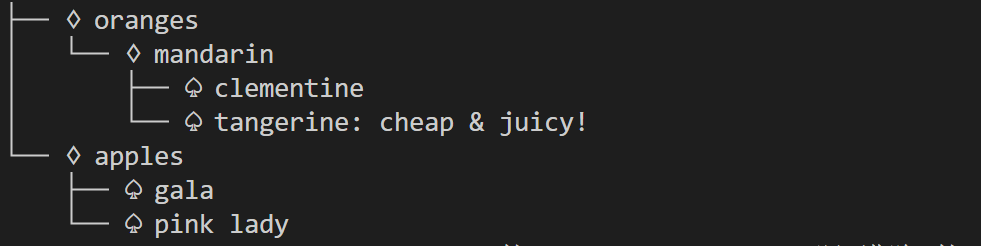
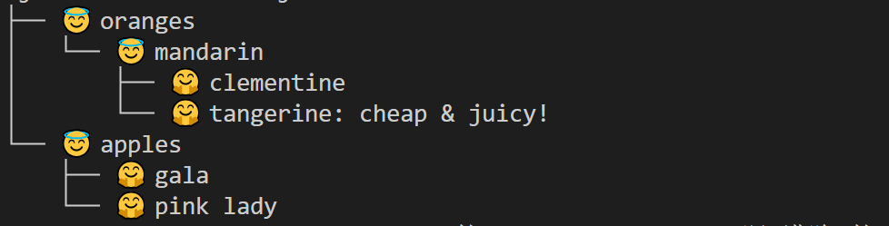
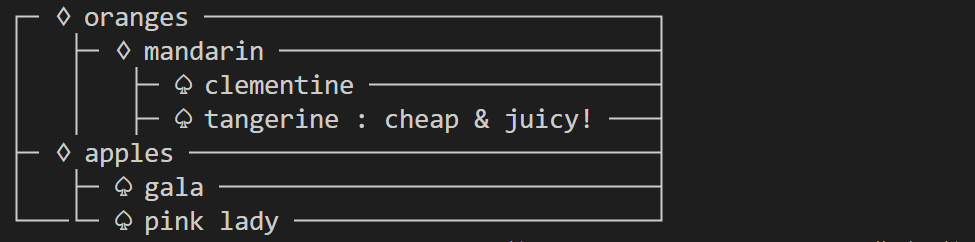
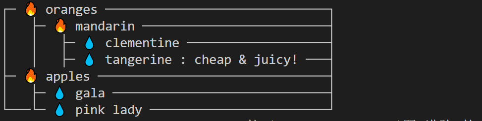

# Funny JSON Explorer PLUS

Funny JSON Explorer（**FJE**）, 一个JSON文件可视化的命令行界面小工具

Funny JSON Explorer PLUS，对已有的FJE实现进行设计重构，改用**迭代器 + 策略模式**进行实现

## 使用方法

在项目根目录使用以下命令：

```shell
cd FJE
python fje.py -f <json file> -s <style> -i <icon family>
```

其中`<json file>`为待可视化的JSON文文件，`<style>`为可视化风格，`<icon family>`为指定的图标族

即可将JSON文件进行可视化：

```json
{
    oranges: {
        'mandarin': {                            ├─ oranges
            clementine: null,                    │  └─ mandarin
            tangerine: 'cheap & juicy!'  -=>     │     ├─ clementine
        }                                        │     └─ tangerine: cheap & juicy!
    },                                           └─ apples
    apples: {                                       ├─ gala
        'gala': null,                               └─ pink lady
        'pink lady': null
    }
}
```


## 功能介绍

### 指定不同风格

FJE可以快速切换**风格**（style），包括：树形（tree）、矩形（rectangle）

```python
# 树形风格
python fje.py -f test_file.json -s tree -i pocker  
├── ♢ oranges
│   └── ♢ mandarin
│       ├── ♤ clementine
│       └── ♤ tangerine: cheap & juicy!
└── ♢ apples
    ├── ♤ gala
    └── ♤ pink lady
    
# 矩形风格
python fje.py -f test_file.json -s rectangle -i pocker
┌─ ♢ oranges ──────────────────────────────┐
|   ├─ ♢ mandarin ─────────────────────────┤
|   |   ├─ ♤ clementine ───────────────────┤
|   |   ├─ ♤ tangerine: cheap & juicy! ────┤
├─ ♢ apples ───────────────────────────────┤
|   ├─ ♤ gala ─────────────────────────────┤
└───└─ ♤ pink lady ────────────────────────┘
```

### 指定不同图标族

也可以指定**图标族**（icon family），为中间节点或叶节点指定一套icon

```python
# 中间节点icon：🔥  叶节点icon：💧   
python fje.py -f test_file.json -s tree -i fire_water
├── 🔥 oranges
│   └── 🔥 mandarin
│       ├── 💧 clementine
│       └── 💧 tangerine: cheap & juicy!
└── 🔥 apples
    ├── 💧 gala
    └── 💧 pink lady

# 中间节点icon：😇 叶节点icon：🤗   
python fje.py -f test_file.json -s tree -i emoji
├── 😇 oranges
│   └── 😇 mandarin
│       ├── 🤗 clementine
│       └── 🤗 tangerine: cheap & juicy!
└── 😇 apples
    ├── 🤗 gala
    └── 🤗 pink lady
```

### 添加新的风格

继承抽象基类`Style`，实现新的风格，并将新风格添加到`config.json`即可！

```json
"styles": {
    "tree": "TreeStyle",
    "rectangle": "RectangleStyle"
    // 风格名 : 实现文件
}
```

### 添加新的图标族

只需修改`config.json`，定义新图标族名称，中间结点和叶节点对应的图标即可！

```json
"icon_families": {
    "pocker": {
      "icon_container": "♢",
      "icon_leaf": "♤"
    },
    //图表族名 : {
	//	"icon_container": 中间结点图标，
	//	"icon_leaf": 叶节点图标
	//}
}
```


## 设计模式

### 迭代器模式

**迭代器模式**允许顺序访问一个集合中的元素，而不暴露其内部表示。在代码中，`JsonIterator`类实现了迭代器模式。

- **JsonIterator**：负责遍历JSON数据结构（可以是字典或列表）。它将数据存入栈中，并在`__next__`方法中按需弹出和处理每个元素。这使得数据的遍历逻辑独立于数据的具体表示。

### 策略模式

**策略模式**定义了一系列可互换的算法，并将每个算法封装起来，使它们可以独立于使用它们的客户类变化。在代码中，`Strategy`抽象基类及其具体实现`TreeStyle`和`RectangleStyle`应用了策略模式。

- **Strategy**：一个抽象基类，定义了`draw`方法。不同的具体策略（如`TreeStyle`和`RectangleStyle`）实现了这个方法，用于展示数据。
- **TreeStyle**和**RectangleStyle**：实现了`Strategy`接口，定义了不同的JSON数据展示方式。

### 整合迭代器模式和策略模式

- **FunnyJsonExplorer**：将迭代器模式和策略模式结合起来。它接受一个策略对象（即具体的展示风格）和一个图标族对象，并使用这些对象展示JSON数据。
  - 使用`JsonIterator`遍历JSON数据。
  - 调用传入的策略对象的`draw`方法进行展示。
- **ExplorerBuilder**：通过组合`StyleFactory`和`IconFamilyFactory`，使用构建器模式简化了`FunnyJsonExplorer`的创建过程。


## 运行截图

- 树形结构

  - pocker图标族（container: `♢`, leaf: `♤`）

    

  - emoji图标族（container: `😇`, leaf: `🤗`）

    

- 长方形结构

  - pocker图标族（container: `♢`, leaf: `♤`）

    

  - fire_water图标族（container: `🔥`, leaf: `💧`）

    


